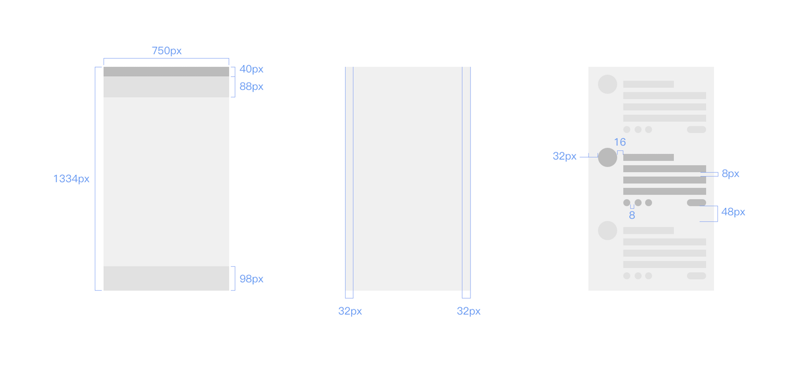
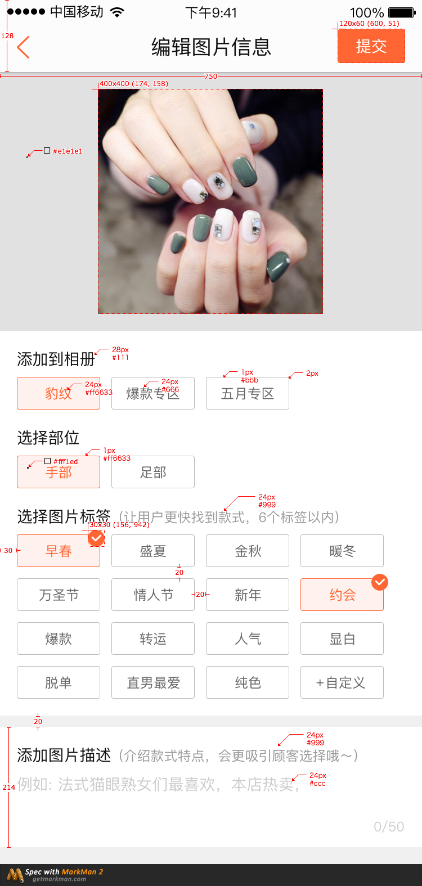
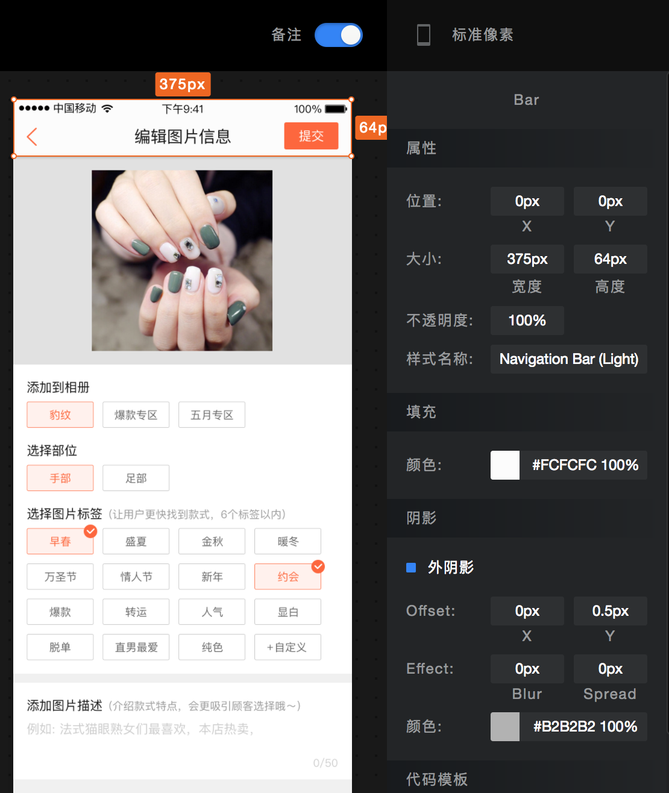
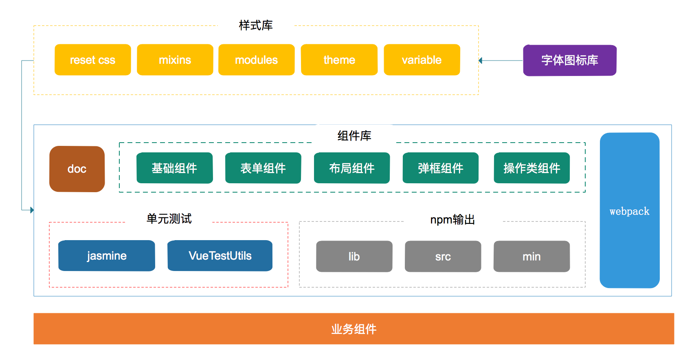

## 介绍

### 关于Swan UI

Swan UI 是一个基于vuejs的移动端组件库，包含丰富的css和js组件。我们的初衷是开发一套展现一致、与业务相契合的组件库，与 [pheonix-styles](https://future-team.github.io/phoenix-styles/example/index.html) 样式库配合使用。组件库在github上开源，也欢迎大家来共同开发。


### 组件

- 基础类
- 表单类
- 布局类
- 弹框类
- 操作类
- 组合类

### 兼容性

- Android 4.4 +
- IOS 8+
- Chrome

###vue版本
- 要求`v2.4.0`及以上

### 基础知识

- [vue](https://cn.vuejs.org/v2/guide/)
- [vue-loader](https://vue-loader.vuejs.org/zh-cn/)
- [webpack](https://doc.webpack-china.org/concepts/)

### 安装

```
npm install swan-ui --save
npm install pheonix-styles --save
```

## CSS样式

### 关于pheonix-styles
pheonix-styles是一套遵循视觉规范的样式库，我们的vue组件库swan-ui和react组件库pheonix-ui都是基于pheonix-styles的dom结构编写的。在使用组件库时，需要引入样式库phoenix-styles。

可以在html中引入：

```xml
<link rel="stylesheet" href="http://future-team.github.io/phoenix-styles/dist/phoenix-styles.min.css" />
```

也可以在js文件中引入：

```javascript
import 'phoenix-styles/dist/phoenix-styles.css'
//或者
import 'phoenix-styles/less/phoenix-less'
```

或者在.vue文件用style标签引入：

```xml
<style lang="less" src="phoenix-styles/less/phoenix-styles.less"></style>
```

### 关于CSS样式
布局、颜色、字体、图标等都有一套完整的视觉规范。以布局为例，布局是页面构成的基础，规定了一些规则来保证同类产品的一致性。

我们的视觉稿基准是iphone6(750 x 1334)，遵循苹果尺寸规范，且原则上保持栅格最小相对距离为8px。



**需要注意的是**，为了适配各种屏幕，我们的组件样式库均使用viewport + rem布局，css样式单位使用rem + px。在使用我们的组件库时，需要引入js文件:

```xml
<script type="text/javascript" src="https://www.dpfile.com/app/gfs-viewport/gfs-viewport.js"></script>
```

并且，**您的业务代码中，css样式都需要使用rem作为单位。**

比如，下面宽750的视觉稿和宽375的视觉稿




如果是左边宽750的视觉稿，顶部高度128，css样式直接除以100

```css
div{
	height: 1.28rem;
}
```
如果是右边宽375的视觉稿，顶部高度64，css样式直接除以50

```css
div{
	height: 1.28rem;
}
```

### 自定义组件样式
在使用组件时，我们可以自定义样式，覆盖组件样式：

```xml
<sw-button class="bg-color">按钮</sw-button>
```
如果无法覆盖，可以写成动态样式的形式：

```xml
<sw-button :class="{'bg-color':true}">默认按钮</sw-button>
```

另一种方式是直接修改phoenix-styles的样式：

```css
.ph-button-primary{
	background-color: red;
}
```

还有一种方式就是使用内联样式：

```xml
<sw-button style="background-color: red;">按钮</sw-button>
```
## 组件命名规范

**事件命名**
 
- 自定义事件以 	`on-xx`开头，最多三个单词，例如 `@on-before-close`
- 自定义原生事件直接使用原声事件名，方便使用。例如 `@click`、`@change`、`@input`、`@drag`

**事件处理器命名**
 
 - 以`handleXXX`命名，例如 handleClick、handleChange、handleInput

 
**slot插槽命名**
 
 主体内容一般使用默认名defalut，不需要设置。其他slot命名一般是：

 - title
 - header
 - footer

## 整体结构


## 快速上手
可以使用官方提供的脚手架工具 [vue-cli](https://github.com/vuejs/vue-cli)来创建项目，也可以跟着下面的步骤来创建项目。

### 新建项目

目录结构

```
.
├── .babelrc
├── README.md
├── index.html
├── package.json
├── src
│   ├── App.vue
│   └── main.js
└── webpack.config.js
```

配置文件

.babelrc

```javascript
{
  "presets": [
  		["es2015", { "modules": false }]
  ],
  "plugins": ["transform-vue-jsx"]
}

```

webpack.config.js

```javascript
var path = require('path')
var webpack = require('webpack')
var ExtractTextPlugin = require("extract-text-webpack-plugin")

module.exports = {
  entry: './src/main.js',
  output: {
    path: path.resolve(__dirname, './dist'),
    publicPath: '/dist/',
    filename: 'build.js'
  },
  module: {
    rules: [
      {
        test: /\.vue$/,
        loader: 'vue-loader',
        options: {
          extractCSS: true
        }
      },
      {
        test: /\.js$/,
        use: 'babel-loader',
        exclude: /node_modules/
      },
      {
        test: /\.css$/,
        use: ExtractTextPlugin.extract('css-loader')
      },
      {
          test:/\.less$/,
          use:  ExtractTextPlugin.extract('less-loader')
      },
      {
        test: /\.(eot|svg|ttf|woff|woff2)(\?\S*)?$/,
        use: 'file-loader?name=../dist/iconfont/[name].[ext]'
      }
    ]
  },
  devServer: {
    historyApiFallback: true,
    noInfo: true
  },
  devtool: '#eval-source-map',
  plugins: [
    new ExtractTextPlugin("style.css")
  ]
}

if (process.env.NODE_ENV === 'production') {
  module.exports.devtool = '#source-map'
  module.exports.plugins = (module.exports.plugins || []).concat([
    new webpack.DefinePlugin({
      'process.env': {
        NODE_ENV: '"production"'
      }
    }),
    new webpack.optimize.UglifyJsPlugin({
      compress: {
        warnings: false
      }
    })
  ])
}
```

package.json

```javascript
{
  "name": "swan-quick-start",
  "version": "1.0.0",
  "description": "",
  "scripts": {
    "dev": "webpack-dev-server --inline --hot --port 4000",
    "build": "webpack"
  },
  "author": "chang20159@foxmail.com",
  "devDependencies": {
    "babel-core": "^6.26.0",
    "babel-loader": "^7.1.2",
    "babel-preset-es2015": "^6.24.1",
    "css-loader": "^0.28.7",
    "extract-text-webpack-plugin": "^3.0.0",
    "file-loader": "^0.11.2",
    "less": "^2.7.2",
    "less-loader": "^4.0.5",
    "style-loader": "^0.18.2",
    "vue-loader": "^13.0.4",
    "vue-template-compiler": "^2.4.3",
    "webpack": "^3.5.6",
    "webpack-dev-server": "^2.7.1"
  },
  "dependencies": {
    "phoenix-styles": "^2.0.6",
    "swan-ui": "^1.0.5",
    "vue": "^2.4.3"
  }
}

```

### 引入组件

在main.js中可通过如下几种方式引入需要的组件：

**整体引入**

```javascript
import Vue from 'vue'
import App from './App.vue'
import 'phoenix-styles/dist/phoenix-styles.css'

import SwanUI from 'swan-ui'
Vue.use(SwanUI)
```

**按需引入**

```javascript
import Vue from 'vue'
import App from './App.vue'
import 'phoenix-styles/dist/phoenix-styles.css'

import {Button,Image,ImageList} from 'swan-ui'
Vue.component(Button.name,Button)
Vue.component(Image.name,Image)
Vue.component(ImageList.name,ImageList)
```

**按需引入**

```javascript
import Vue from 'vue'
import App from './App.vue'
import 'phoenix-styles/dist/phoenix-styles.css'

import Button from 'swan-ui/lib/Button'
import Image from 'swan-ui/lib/Image'
import ImageList from 'swan-ui/lib/ImageList'
Vue.component(Button.name,Button)
Vue.component(Image.name,Image)
Vue.component(ImageList.name,ImageList)
```

或者在App.vue中局部注册：

```javascript
import {Button,Image,ImageList} from 'swan-ui'
export default {
	name: 'App',
	components: {
	    [Button.name]:Button,
	    [Image.name]:Image,
	    [ImageList.name]: ImageList
	}
}
```

### 使用组件
然后在App.vue中使用组件：

```
<template>
    <div class="container">
        <h4>Hello, Swan UI</h4>
        <sw-image-list :column="2">
            <sw-image v-for="(item,index) in images" 
                      :key="index"
                      :src="item"></sw-image>
        </sw-image-list>
        <sw-button class="fix-bottom" 
                   block 
                   @click="handleClick">点我查看图片</sw-button>
    </div>
</template>

<script>
    import {Button,Image,ImageList} from 'swan-ui'
    export default {
        components: {
            [Button.name]:Button,
            [Image.name]:Image,
            [ImageList.name]: ImageList
        },
        data(){
            return{
                images: null
            }
        },
        methods:{
            handleClick(){
                this.images = [
                    'https://fuss10.elemecdn.com/b/2e/a6c333694efb4db66c6a3ba07e9d8jpeg.jpeg?imageMogr2/thumbnail/200x200/format/webp/quality/85',
                    'https://fuss10.elemecdn.com/e/6c/0de9d18ef47292380826be8d8cfe8jpeg.jpeg?imageMogr2/thumbnail/200x200/format/webp/quality/85',
                    'https://fuss10.elemecdn.com/9/78/f449290a86fb3ca7d793a5cc50344jpeg.jpeg?imageMogr2/thumbnail/200x200/format/webp/quality/85',
                    'https://fuss10.elemecdn.com/b/ce/fdff43a9ea94d46706be48f50bc26jpeg.jpeg?imageMogr2/thumbnail/200x200/format/webp/quality/85'
                ]
            }
        }
    }
</script>

<style lang="less">
    .container{
        h4{
            text-align: center;
            margin-top: 20px;
        }
    }
    .fix-bottom{
        position: fixed;
        bottom: 15px;
    }
</style>
```


最后在main.js中将节点添加到id为app的dom节点：

```
new Vue({
  el: '#app',
  render: h => h(App)
})
```

### 运行

```
npm run build
```

```
npm run dev
```

## 版本更新

- v1.0.2 提供压缩/未压缩打包文件
- v1.0.3 修复TabSet组件无法动态更新的问题
- v1.0.4 统一事件名称、filter组件数据结构、补充文档
- v1.0.5 修复prompt默认取消按钮无法关闭问题
- v1.0.6 修复Image无法动态更新

## 更多

- 基于React的移动端组件库 [phoenix-ui](https://future-team.github.io/phoenix-ui/doc/)
- 图标库 [gfs-icons](https://future-team.github.io/gfs-icons/index.html)

